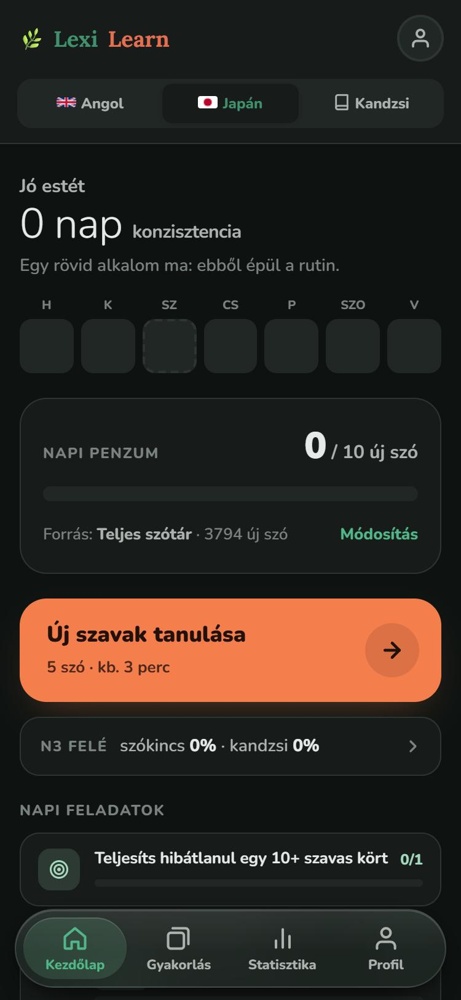
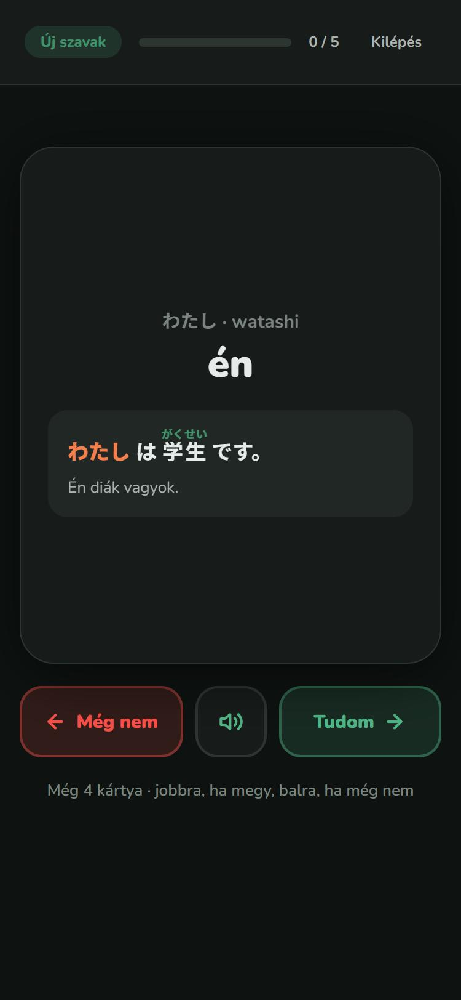
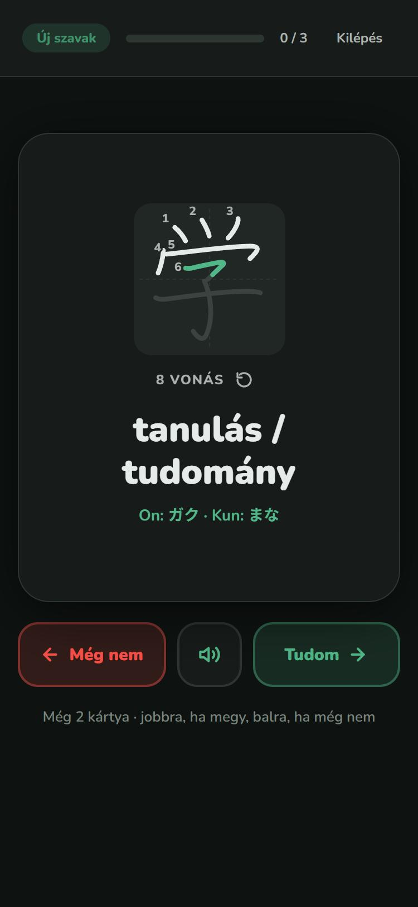
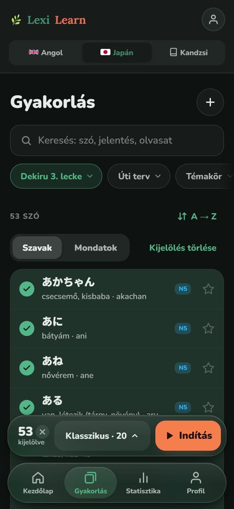
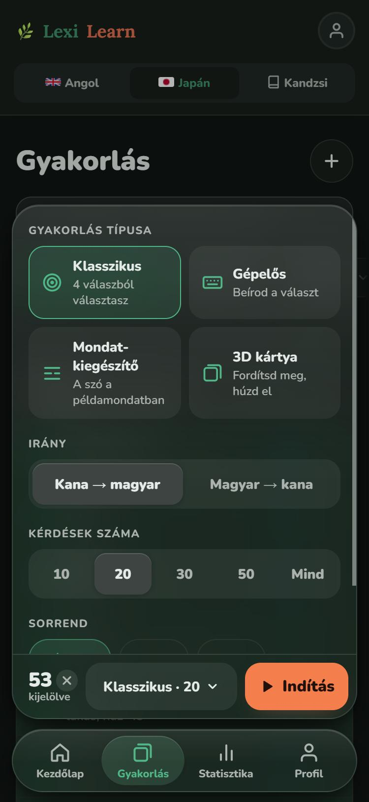
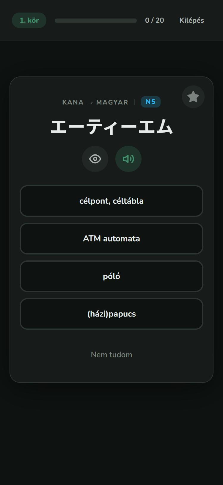
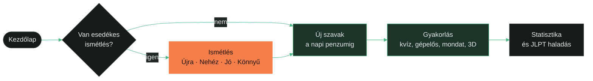
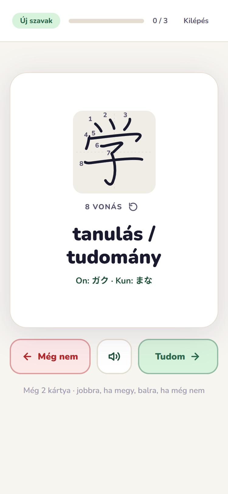
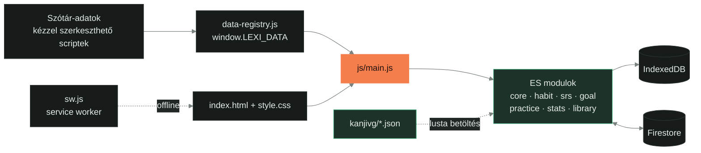

<p align="center">
  <a href="https://nokedli25ttv.github.io/LexiLearn/">
    
  </a>
</p>

<p align="center">
  <a href="https://nokedli25ttv.github.io/LexiLearn/"></a>
  
  
  
  <br>
  
  
  
  
</p>

<p align="center">
  <b>Szótanuló, ami a napi szokásra épít, nem a hajrára.</b><br>
  Japán a JLPT N3 felé (kana, szókincs, kandzsi vonássorrenddel), mellette angol.<br>
  Telefonra, egy kézre, offline is, több eszköz között szinkronban.
</p>

---

## Képernyők

<table>
  <tr>
    <td align="center" width="33%">
      
      <br><sub><b>Kezdőlap</b><br>konzisztencia, napi penzum, egyetlen fő lépés</sub>
    </td>
    <td align="center" width="33%">
      
      <br><sub><b>Új szó kártya</b><br>húzd jobbra, ha megy, balra, ha még nem</sub>
    </td>
    <td align="center" width="33%">
      
      <br><sub><b>Vonássorrend</b><br>a kandzsi vonásonként megrajzolódik</sub>
    </td>
  </tr>
  <tr>
    <td align="center" width="33%">
      
      <br><sub><b>Gyakorlás</b><br>szűrhető szótár, lebegő dokk</sub>
    </td>
    <td align="center" width="33%">
      
      <br><sub><b>Beállítások a hüvelykujj alatt</b><br>típus, irány, kérdésszám, sorrend</sub>
    </td>
    <td align="center" width="33%">
      
      <br><sub><b>Kvíz</b><br>okos zavaró válaszokkal, kiejtéssel</sub>
    </td>
  </tr>
</table>

> [!TIP]
> Telefonon nyisd meg az [élő verziót](https://nokedli25ttv.github.io/LexiLearn/), és a böngésző menüjéből add hozzá a kezdőképernyőhöz. Így teljes képernyős appként indul, és internet nélkül is működik.

## Egy nap a LexiLearnnel



A Kezdőlapon mindig egyetlen korall gomb mutatja a következő lépést: ha van esedékes ismétlés, az jön először, utána az új szavak. A napi limit szándékos: módonként 10 új szó (kandzsiból 5, a Profilban állítható), hogy a tudás rögzüljön, és ne legyen kiégés.

## Minden, ami benne van

### Napi szokás, nem hajrá

- **Konzisztencia:** hány egymást követő napon tanultál, alatta a hét napjai pöttysorban. A kihagyott nap nem büntetés, csak tény.
- **Napi penzum:** japán módban automatikusan a Dekiru 1. leckétől halad előre, leckénként; ha egy lecke végén kevesebb szó marad a napi célnál, a következő leckéből tölti fel az adagot. A Gyakorlás fül szűrői ezt nem módosítják.
- **Előrejelzés:** egy csendes sor arról, mennyi ismétlés jön holnap és a következő héten, hogy ne érjen meglepetés.
- **Napi feladatok:** naponta három, változó feladat, például egy hibátlan kör, tematikus nap, a nap szava, régen látott szavak vagy a legtöbbször elrontott szavak javítása.
- **Egyetlen ünneplés:** konfetti csak akkor, ha a napi cél teljesült, és akkor is naponta egyszer.

### Új szavak: húzható kártyák

- Jobbra húzva „Tudom”, balra „Még nem”; a pecsét a húzás mértékével jelenik meg, küszöb felett a kártya kirepül.
- Koppintásra megfordul: jelentés, kandzsi írásmód, romaji és egy példamondat furiganával, magyar fordítással.
- A „Még nem” kártya a sor végére kerül, és addig visszajön, amíg egyszer nem megy.
- Kiejtés japánul és angolul (iOS kezdőképernyős appban is), billentyűzettel a nyilak és a Szóköz is működik.

### Ismétlés: Anki-szerű ütemezés (FSRS-5)

- Négy gomb: **Újra, Nehéz, Jó, Könnyű**, mindegyik alatt a következő ismétlésig hátralévő idő („ma”, „3 n”, „2 hó”).
- 90%-os célzott megtartás, napi felbontás; a „Rögzült” szó ismétlési köze legalább 21 nap.
- Egy alkalom legfeljebb 20 kártya; az „Újra” még aznap visszajön. Húzással (balra Újra, jobbra Jó) és az 1-4 billentyűkkel is értékelhetsz.
- A napi tanulásban már sikerült, illetve a szabad gyakorlásban legalább ötször helyesen megválaszolt szavak kerülnek az SRS-be és a JLPT-haladásba. Ezeknél egy hibás gyakorlóválasz másnapra előrehozza az ismétlést.

### Kandzsi: 1715 írásjegy, vonássorrenddel

<table>
<tr>
<td width="50%" valign="top">

- N5-től N1-ig, magyar jelentéssel, on és kun olvasattal, romajival, témakörökkel.
- A kártya hátoldalán egy írásgyakorló négyzetben **a kandzsi vonásonként megrajzolódik**: az épp rajzolódó vonás zöld, a kész tintaszínű, a sorszám a vonás kezdetén jelenik meg.
- Alatta a vonások száma és egy újrajátszás gomb. Csökkentett mozgás beállítás mellett a kész, számozott ábra látszik.
- Az adat a [KanjiVG](https://kanjivg.tagaini.net) projektből jön, szintenként töltődik le, és utána offline is megvan.
- A V13.9-es kiadás minden kandzsit átnézett: 337 javítás a jelentésekben, az olvasatokban és a romajiban.

</td>
<td width="50%" align="center">

<br><sub>világos témában, a kész ábrával</sub>
</td>
</tr>
</table>

### Gyakorlás: a teljes szótár kézben

- **Keresés** szóra, jelentésre és olvasatra; **lenyíló szűrőpillák:** Lecke (Dekiru), Úti terv (nap), Témakör, Szint, Lista, Rendezés. Minden pilla a kiválasztott értéket mutatja.
- Szavak és Mondatok nézet, kijelölés, csillag (könyvjelző), saját listák.
- **Lebegő dokk** a képernyő alján: a kijelöltek száma, a beállítások összefoglalója és a korall Indítás gomb.
- **Négy gyakorlástípus:**

| Típus | Mit csinálsz |
|---|---|
| Klasszikus | négy válaszból választasz; a zavaró válaszok hasonló szavakból jönnek |
| Gépelős | beírod a választ; japánnál kanával vagy romajival is jó |
| Mondat-kiegészítő | a szó a példamondatban hiányzik |
| 3D kártya | megfordítod, és elhúzod, ha tudtad |

- Irány (kana → magyar vagy fordítva), kérdésszám (10, 20, 30, 50 vagy mind), sorrend (véletlen, betűrend, könnyebb vagy nehezebb elöl).
- Körökben halad: a hibás szavak a következő körbe kerülnek. A kör végén pontosság, helyes és hibás válaszok, idő, és a hibás szavak listája.

### Statisztika és JLPT N3 haladás

- **KPI sáv:** Konzisztencia, Aktív napok (30), Rögzült szavak, Fókusz a héten.
- **Konzisztencia hőtérkép** GitHub-stílusú naptárban, **tudás-érettség** (Ismerkedés, Gyakorlás alatt, Rögzült), **pontosság** és **fókuszált idő** az elmúlt 14 napról. Minden ábrának van táblázatos nézete is.
- **JLPT haladás:** mérföldkő-sáv N5-től N3-ig (szókincs és kandzsi külön), célidőpont (alapból 2027. július 4., átállítható), szükséges tempó, 14 napos átlag, várható dátum és szótár-lefedettség. A Kezdőlapon egy sor mutatja: „N3 FELÉ szókincs 24% · kandzsi 20%”.
- Fülek szintekre és témakörökre, szavakra, előzményekre és a Dekiru leckékre.

### Szótár

| Mód | Tartalom |
|---|---|
| Japán | 3794 szó (N5-N3, a JLPT kb. 3750 szavas célját lefedi), kanával, romajival, kandzsi írásmóddal, témakörökkel; 24 Dekiru lecke szószedete; 2760 példamondat |
| Kandzsi | 1715 kandzsi N5-től N1-ig, jelentéssel, olvasatokkal és vonássorrenddel |
| Angol | 927 szó szintekkel és témakörökkel, 920 példamondat |
| Úti terv | 15 napos szó- és 25 napos kandzsi-terv egy japán útra, napra bontva |

Saját szó felvehető kézzel vagy listából importálva.

### Offline és felhő

- **PWA:** telepíthető, a service worker minden fájlt eltárol, így internet nélkül is teljes értékű.
- **Google bejelentkezés** és Firestore szinkron több eszköz között; mentéskor csak a megváltozott részek íródnak.
- **Biztonsági mentés** egy fájlba (statisztika, listák, saját szavak), telefoncserénél egy kattintással visszaállítható.

### Kényelem és hozzáférhetőség

- Sötét téma alapból, meleg világos téma egy kapcsolóra.
- Egy kéz, egy hüvelykujj: a navigáció és a gyakorlás indítása alul, lebegő sávon.
- WCAG AA kontraszt mindkét témában, `prefers-reduced-motion` tisztelete, billentyűzetes alternatíva minden húzáshoz, legalább 44 px-es érintési felületek.
- Felnőtt, nyugodt nyelvezet: Konzisztencia, Napi penzum, Napi feladatok.

## Színek és formák

A design iránya: **„A Nyugodt Dojo”**. Egy japán edzőterem csendje, ahol minden nap ugyanazzal a figyelemmel gyakorolsz.

| | Név | Szerep |
|---|---|---|
|  | Parázs korall | az egyetlen „nyomd meg” szín, képernyőnként egy |
|  | Levélzöld | haladás, kijelölés, az épp rajzolódó vonás |
|  | Erdőzöld | világos témában a haladás színe |
|  | Terrakotta | a logó „Learn” szava |
|  | Éjszakai erdő | a sötét téma háttere, zöld felé tört |
|  | Papír | a világos téma háttere |

Betűk: **Nunito** az egész felületen, **Lora** csak a logóban. A részletes rendszer a [DESIGN.md](DESIGN.md)-ben, a termék célja és hangja a [PRODUCT.md](PRODUCT.md)-ben van.

## Technika



- **Build lépés nélkül:** vanilla JavaScript ES modulokkal, a GitHub Pages közvetlenül a `main` ágból szolgálja ki.
- **FSRS-5** saját megvalósítással (`js/srs/`), **localforage** (IndexedDB), **Firebase** Auth és Firestore.
- **65 automata teszt** Vitesttel és jsdommal: golden master a teljes app kimenetére, adatellenőrzés (N3 szókincs, kandzsi olvasatok, vonássorrend), a felhő szinkron memóriabeli Firestore-ral, a service worker előtöltési listája, és minden gombhoz tartozó kezelő.

```bash
npm install        # csak a fejlesztői eszközök (tesztek, lint)
npm run serve      # http://localhost:5599
npm run check      # lint + az összes teszt
```

> [!NOTE]
> Az `index.html` fájlként megnyitva nem indul el, mert a böngésző az ES modulokat csak szerverről tölti be. A felépítés, a felhő adatformátum, az ütemezés és a tesztek részletes leírása a [docs/FEJLESZTES.md](docs/FEJLESZTES.md)-ben van.

## Források

- **Vonássorrend:** [KanjiVG](https://kanjivg.tagaini.net), © Ulrich Apel, [CC BY-SA 3.0](https://creativecommons.org/licenses/by-sa/3.0/deed.hu). A `kanjivg/` mappa adatai ebből származnak, és ugyanezen licenc alatt használhatók tovább.
- **Ismétlésütemezés:** az [FSRS](https://github.com/open-spaced-repetition) algoritmus 5. változata, az alapértelmezett paraméterekkel.
- **Betűk:** Nunito és Lora (Google Fonts, SIL Open Font License).
- **Tárolás és felhő:** [localforage](https://github.com/localForage/localForage), [Firebase](https://firebase.google.com).
